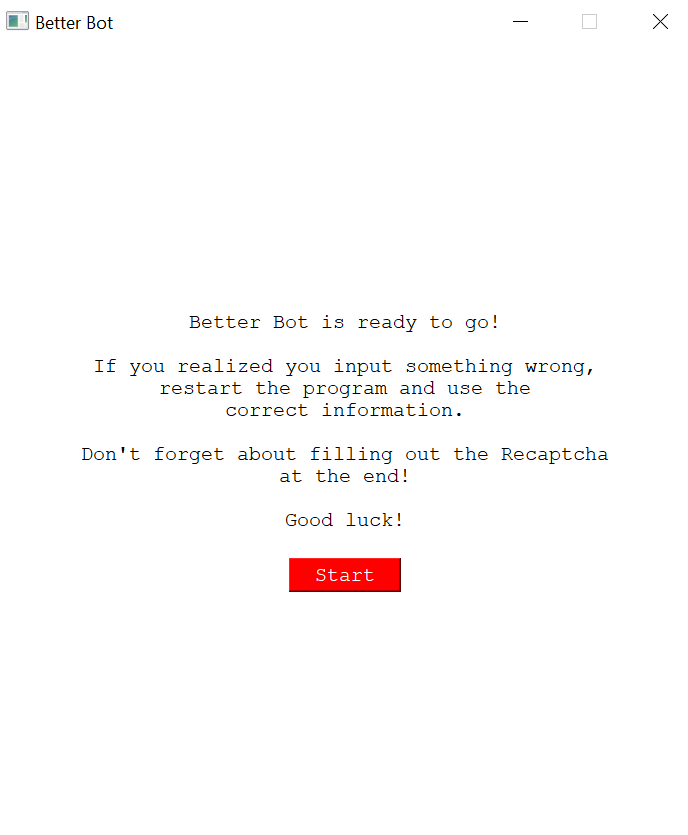

# BetterBot

This repository contains the source code for my Python application, **_BetterBot_**.

Feel free to fork this project and make changes to create your own checkout automator for Supreme. For documentation, please refer to inline comments within source code.

*Note: This bot was built in 2020 and is not updated for the current Supreme drop season.*

## Overview
BetterBot is a multi-threaded checkout automator driven by Selenium for the clothing company, Supreme. Supreme is a sought-after company and many of their products sell out in a matter of seconds. To get your hands on the item you desire is nearly impossible if done manually.

However, with BetterBot, your are able to automate your checkout in less than 3 seconds after a few simple steps.

## Process

### 1. Enter Shipping/Billing Address

### 2. Enter Payment Information

### 3. Go!
